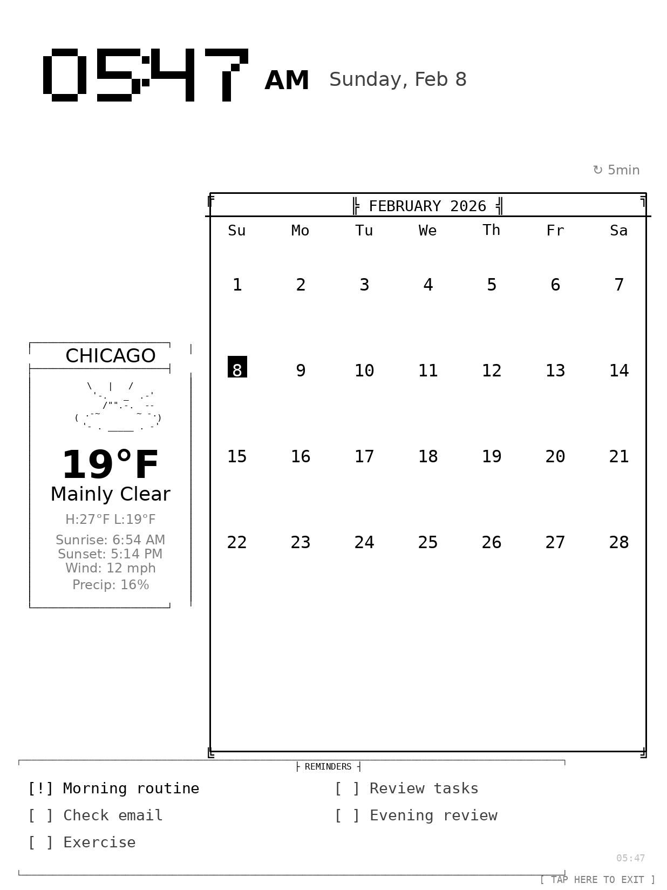

# paperterm

A terminal-aesthetic dashboard for jailbroken Kindle e-readers, hosted on GitHub.

> *paper* + *terminal* — e-ink meets command line aesthetics



## Features

- **Weather** - Current conditions, temperature, high/low
- **Artwork** - Rotating e-ink optimized images
- **Reminders** - Simple to-do list from text file
- **Time/Date** - Current time in your timezone

## How It Works

```
┌─────────────────────────────────────────────────────────────┐
│ GitHub Actions runs every 15 minutes                        │
│   └── Generates dashboard.png from weather API + config     │
│         └── Commits to repo                                 │
│               └── GitHub Pages serves the image             │
│                     └── Kindle fetches and displays         │
└─────────────────────────────────────────────────────────────┘
```

## Setup

### 1. Fork This Repository

Click "Fork" to create your own copy.

### 2. Enable GitHub Pages

1. Go to Settings → Pages
2. Source: "GitHub Actions"
3. Save

### 3. Configure Your Dashboard

Edit `config.yml`:

```yaml
weather:
  latitude: YOUR_LATITUDE
  longitude: YOUR_LONGITUDE
  unit: "fahrenheit"

time:
  timezone: "America/Chicago"
```

### 4. Configure Your Kindle

Update the TRMNL script or create a new one pointing to:
```
https://YOUR_USERNAME.github.io/paperterm/dashboard.png
```

### 5. Add Artwork

Drop e-ink optimized images into `artwork/` subdirectories:
- `artwork/nature/`
- `artwork/typography/`
- `artwork/illustrations/`
- `artwork/abstract/`

### 6. Update Reminders

Edit `reminders.txt`:
```
[!] High priority item
[ ] Normal item
# This is a comment
[x] Completed (won't show)
```

## Local Development

```bash
# Install dependencies
pip install -r requirements.txt

# Generate dashboard locally
cd src
python render.py

# View output
open ../output/dashboard.png
```

## Configuration Options

See `config.yml` for all options:

| Option | Description |
|--------|-------------|
| `weather.latitude/longitude` | Your location |
| `weather.unit` | "fahrenheit" or "celsius" |
| `time.timezone` | IANA timezone (e.g., "America/New_York") |
| `artwork.enabled` | Enable/disable artwork |
| `artwork.rotation_interval` | Refreshes before changing art |
| `reminders.max_items` | Max reminders to show |

## E-Ink Artwork Guidelines

For best results on e-ink displays:

- **Resolution**: 1236 × 1648 pixels (Kindle PW 11th gen)
- **Color**: Grayscale only
- **Contrast**: High contrast works best
- **Style**: Line art, typography, minimalist designs

See `EINK_ARTWORK_STANDARDS.md` for detailed guidelines.

## Roadmap

- [ ] Calendar integration
- [ ] Google Tasks sync
- [ ] Multiple layout modes
- [ ] Weather forecast graph
- [ ] Custom fonts

## Credits

- Weather data from [Open-Meteo](https://open-meteo.com/) (free, no API key)
- Built for jailbroken Kindles using [KUAL](https://www.mobileread.com/forums/showthread.php?t=203326)

## License

MIT License - feel free to customize for your own use!
